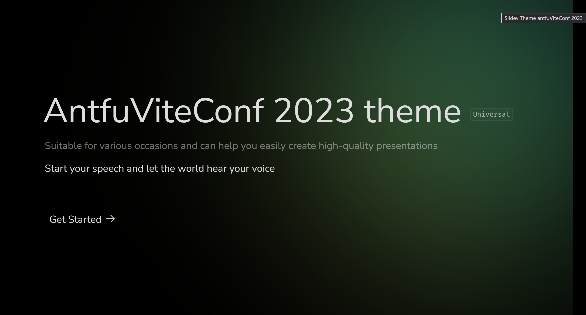
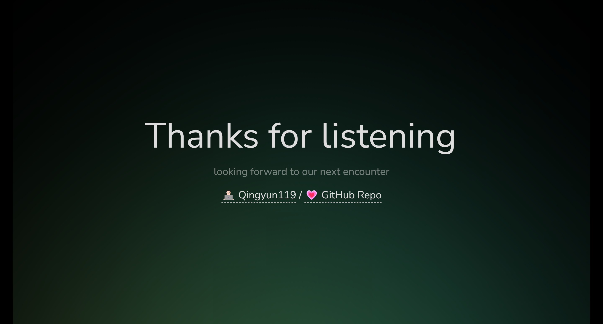

# slidev-theme-antfu-vite-conf-2023

[](https://www.npmjs.com/package/slidev-theme-antfu-vite-conf-2023)

A reproduce the ppt style of antfu's speech at viteConf2023 theme for [Slidev](https://github.com/slidevjs/slidev).

Live demo: [here](https://slidev-theme-antfu-vite-conf-2023.fe-ecosphere.com/)

## Install

Add the following frontmatter to your `slides.md`. Start Slidev then it will prompt you to install the theme automatically.

<pre><code>---
theme: <b>antfu-vite-conf-2023</b>
---</code></pre>

It is also required to install the npm package vite-svg-loader and adding a vite.config.js in your project with the following:

```ts
import svgLoader from 'vite-svg-loader'

export default {
  plugins: [svgLoader()],
}
```

Learn more about [how to use a theme](https://sli.dev/themes/use).

## Layouts

This theme provides the following layouts:

### Custom light gradient color
> Gradient color is implemented using CSS

Gradient color default value: 
```css
.defaltLinearGradient {
    background-image: linear-gradient(to right , rgb(207 200 89 / 1 ) 0% , rgb(77 189 127 / 1 ) 50% , rgb(77 189 172 / 1 ) 100%)
}
```

```md
---
themeConfig:
 linearGradient: 'linear-gradient(120deg, #a1c4fd 0%, #c2e9fb 100%)'
---
```

### Configure lighting direction

Provides 8 different angles of lighting directions
> Number mapping in position matches ppt page number

```md
---
themeConfig:
 linearGradient: 'linear-gradient(120deg, #a1c4fd 0%, #c2e9fb 100%)'
 position: 
  1: right-up
  2: right-middle
  3: right-down
  4: left-down
  5: left-middle
  6: left-up
  7: top-up
  8: top-down
---
```

## Case

Start                       | End
:-------------------------:|:-------------------------:
 | 

## Thank

- https://talks.antfu.me/2023/viteconf/1
- https://antfu.me/posts/roads-to-oss-set-theory-viteconf-2023
- https://sli.dev/