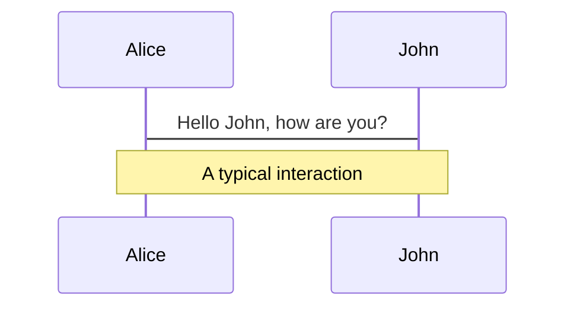
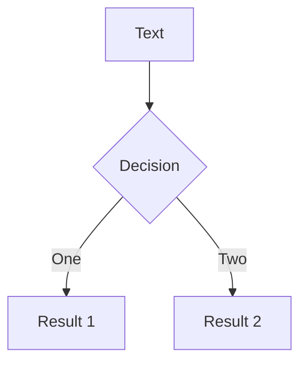
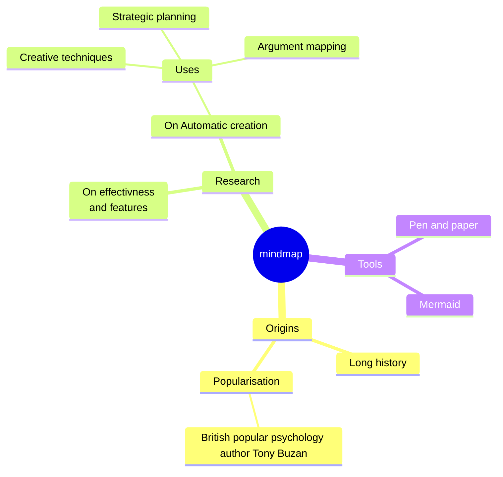
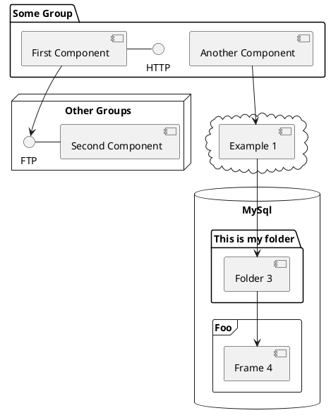

# Doli theme <sup class="opacity-70 text-xl"><kbd>Universal</kbd></sup>

Suitable for various occasions and can help you easily create high-quality presentations

Start your speech and let the world hear your voice

<div class="pt-12">
  <span @click="()=> $slidev.nav.next()" class="px-2 p-1 rounded cursor-pointer hover:bg-white hover:bg-opacity-10">
   Get Started <carbon:arrow-right class="inline"/>
  </span>
</div>

---
layout: intro
---

# Inspiration and Advantages

The template style is taken from the PPT presented by Antfu at VueConf 2023

### Using the Slidev solution. What is Slidev?

***

- 📝 **Text-based** - focus on the content with Markdown, and then style them later
- 🎨 **Themable** - theme can be shared and used with npm packages
- 🧑‍💻 **Developer Friendly** - code highlighting, live coding with autocompletion
- 🤹 **Interactive** - embedding Vue components to enhance your expressions
- 🎥 **Recording** - built-in recording and camera view
- 📤 **Portable** - export into PDF, PNGs, or even a hostable SPA
- 🛠 **Hackable** - anything possible on a webpage
j
<br>
<br>

Read more about [Why Slidev?](https://sli.dev/guide/why)


---
layout: intro
---

# Data sheet

The table style is a concise and clear way of presenting tables for displaying the relationships and comparisons between data

## Table case

|     |     |
| --- | --- |
| <kbd>space</kbd> / <kbd>tab</kbd> / <kbd>right</kbd> | next animation or slide |
| <kbd>left</kbd>  / <kbd>shift</kbd><kbd>space</kbd> | previous animation or slide |
| <kbd>up</kbd> | previous slide |
| <kbd>down</kbd> | next slide |

---
layout: two-cols
---

# Code

<p class="opacity-50">Use code snippets and get the highlighting directly</p>

```ts
interface User {
  id: number
  firstName: string
  role: string
}

function updateUser(id: number, update: Partial<User>) {
  const user = getUser(id)
  const newUser = { ...user, ...update }
  saveUser(id, newUser)
}
```

```ts
import { createApp, ref } from 'vue'

createApp({
    setup() {
        return {
            count: ref(0)
        }
    }
}).mount('#app')
```

::right::

<div class="w-full h-full flex ml-10 mt-10 items-center">
    
</div>


---
layout: intro
---

## Visual charts

<p class="opacity-50">You can create diagrams / graphs from textual descriptions, directly in your Markdown</p>

<div class="grid grid-cols-4 gap-5 pt-4 -mb-6">









</div>

---
layout: intro
---

## Scientific formula by LaTeX

<p class="opacity-50">LaTeX is supported out-of-box powered by <a href="https://katex.org/">KaTeX</a></p>

<br>

Inline $\sqrt{3x-1}+(1+x)^2$

Block
$$ {1|3|all}
\begin{array}{c}

\nabla \times \vec{\mathbf{B}} -\, \frac1c\, \frac{\partial\vec{\mathbf{E}}}{\partial t} &
= \frac{4\pi}{c}\vec{\mathbf{j}}    \nabla \cdot \vec{\mathbf{E}} & = 4 \pi \rho \\

\nabla \times \vec{\mathbf{E}}\, +\, \frac1c\, \frac{\partial\vec{\mathbf{B}}}{\partial t} & = \vec{\mathbf{0}} \\

\nabla \cdot \vec{\mathbf{B}} & = 0

\end{array}
$$

<br>
---
layout: two-cols
---

# Components

<div class="mt-20">
<div>

You can use Vue components directly inside your slides.

We have provided a few built-in components like `<Tweet/>` that you can use directly. And adding your custom components is also super easy.

Check out [the guides](https://sli.dev/builtin/components.html) for more.

</div>
<div>

```html
<Tweet id="1390115482657726468" />
```
</div>
</div>

::right::

<div class="mt-20 pl-20">
   <Tweet id="1390115482657726468" scale="0.65" />
</div>


---
layout: intro
class: "text-center"
---

# Thanks for listening

looking forward to our next encounter

[👨🏻‍💻 Qingyun119](https://github.com/LQYld) / [💗 GitHub Repo](https://github.com/slidevjs/slidev)